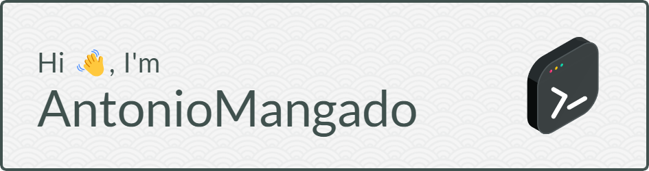

<p><em>Junior FullStack developer from <a href="https://www.thebridge.tech/">TheBridge</a>

[](https://www.linkedin.com/in/antonio-mangado/)
[](https://github.com/AntonioMangado)


###  A little more about me...  

```javascript
const spaniard = {
  pronouns: "he" | "him",
  code: [Javascript, HTML, CSS],
  tools: [React, Astro, Tailwind, SASS, Node, Express, MongoDB, PostgreSQL, Cypress, Docker],
  architecture: "model and view",
  challenge: ["currently going through FreeCodeCamp certifications", "learning Python"]
}
```

<em><b>I love connecting with different people</b> .If you want to say <b>hi, I'll be happy to chat!</b> :)</em> 

---
